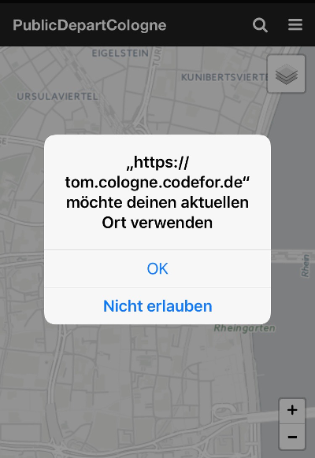
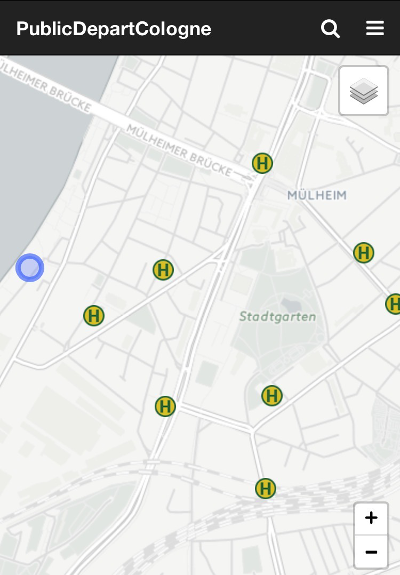
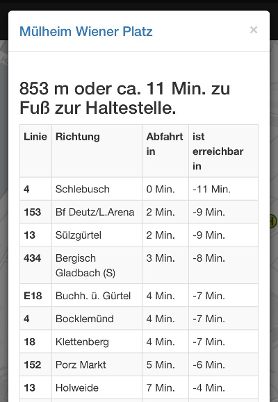

# PublicDepartCologne

Dieses Projekt soll es Nutzern des öffentliche Personen Nahverkehrs in Köln aufgrund ihres Aufenthaltortes und anhand von Echtzeitdaten zu Abfahrtszeiten ermöglichen, abzuschätzen, ob sie eine z.B. eine Strassenbahn noch zu Fuss erreichen können. Dadurch wird es möglich, z.B. Umwege für Besorgungen oder zur Zerstreuung zu planen, ohne die Bahn/ den Bus zu verpassen.

Ziel war es diese Information mit so wenig Interaktion durch die Benutzer wie möglich zur Verfügung zu stellen. Um einen einfachen Zugang zur Applikation zu ermöglichen, handelt es sich um eine Webapplikation, die sowohl auf dem Desktop, als auch auf Tablet-Computern und Smartphones mit Hilfe eines Browsers angezeigt verwendet werden kann.

Um den Benutzern eine größtmögliche Selbstbestimmung bei der Wahl der Haltestelle zu ermöglichen, ist ein Grundverständnis der Kölner Strassen und Haltestellen notwendig. 

Grundlage des Projektes sind [Offene Daten der Stadt Köln](https://www.offenedaten-koeln.de/) zu den [VRS Verkehrsdaten GTFS](https://www.offenedaten-koeln.de/dataset/vrs-verkehrsdaten-gtfs) die [aktuellen Abfahrtszeiten der Kölner Verkehrsbetriebe](http://www.kvb-koeln.de/generator/), sowie dem Fussgängerrouting auf Basis von [Graphhopper](https://www.graphhopper.com/de/) und [OSM](https://www.openstreetmap.de/). Weiterhin können die aktuellen [Standorte Fahrradverleih Koeln - KVB-Rad](https://www.offenedaten-koeln.de/dataset/standorte-fahrradverleih-koeln-kvb-rad) eingeblendet werden.

Diese Projekt ist im Rahmen von [Hack Your City 2017](http://www.hackyourcity.de/koeln/) in Köln entstanden und befindet sich in der Entwicklung.

# Benutzung

Grundlage für die Benutzung ist die Freigabe der Ortungsdienste für den verwendeten Web-Browser. Diese werden nur temporär für die Zwecke der Anwendung verwendet und nicht aufgezeichnet. Eine personenbezogene Speicherung von Daten findet nicht statt. 

Sobald der Ort bestimmt wurde, werden die nächsten Haltestellen ermittelt und auf diese mit dem aktuellen Aufenthaltsort in der Mitte eingezoomt. Die Haltestellen sind mit einem Haltestellen Symbol gekennzeichnet. 

Mit Tippen auf eine Station werden die aktuellen Abfahrtszeiten abgefragt, sowie ein Fussgänger - Routing vom aktuellem Aufenthaltsort zu der jeweiligen Haltestelle durchgeführt. Mit dieser Information wird die Zeit errechnet, die vermutlich zu Fuss bis zur Haltestelle benötigt wird. Dabei wird der Strassenverlauf berücksichtigt. Zusätzliche Zeiten etwa weil es sich um eine U-Bahn oder Hochbahn - Haltestelle handelt, werden nicht berücksichtigt. 

Die Zeit der Abfahrt wird gegen die Zeit des Weges bis zur Haltestelle aufgerechnet. Das Ergebnis ist ein Hinweis darauf ob z.B. der Bus erreichbar ist. Natürlich können nach eigenem Ermessen z.B. durch Beschleunigung der Schritte auch Verkehrsmittel erreicht werden, die als nicht erreichbar gekennzeichnet sind. Entsprechend ist es möglich, dass Bussen/ Bahnen, obwohl rechnerisch in direkter Nähe zum Aufenthaltsort, aus baulichen Gründen trotz entsprechender Anzeige nicht erreicht werden können.

Als alternative Fortbewegungsmittel können die Standorte der KVB-Fahrräder eingeblendet werden. Mit Tippen auf das Fahrradsymbol wird wie bei den Haltestellen die Entfernung und die zu erwartende Zeit bis zum Fahrrad eingeblendet. Es ist nicht möglich darüber ein Fahrrad zu buchen. Auch kann es sein, dass ein Fahrrad bei Ankunft bereits verliehen ist.

# Entwicklungsstand

Diese Anwendung befindet sich in Entwicklung

# Entwicklungspfad

- Überarbeitung der Abfahrtstabelle, um Filtern und Sortieren zu ermöglichen;
- Einblenden des Fusswegs vom aktuellen Aufenthaltsort zur Haltstellen;
- Folgen des aktuellen Aufenthaltsortes auf der Karte bei Bewegung;
- Verhalten, wenn der Ort nicht freigegeben wurde;
- Verhalten, wenn sich die Abfrage ausserhalb des Geltungsbereichs befindet.

# verwendete Technologien

Zentraler Bestandteil ist ein Backend, dass es ermöglicht, die nächsten Stationen zu einer übergebenen Geokoordinate anzuzeigen ([publicTransportStation](https://github.com/weberius/publicTransportStation)).  Weiterhin wird ein Fussgängerrouting auf Basis der OSM Daten benötigt ([feetandbikerouting](https://github.com/weberius/feetandbikerouting)). Darüber hinaus ist ein Mechnanismus notwendig, um die Abfahrtsinformation per REST-Schnittstelle json-Formatiert zur Verfügung zu stellen ([kvbabfahrtsmonitor](https://github.com/weberius/kvbabfahrtsmonitor)).

- html
- javascript
- Java
- PostGres
- REST (json/ geojson)
- [Graphhopper](https://www.graphhopper.com/de/)/ [OSM](https://www.openstreetmap.de/)

# Datenbank

## DB User auf Postgres einrichten

    sudo -u postgres haltestellen -P hackcity
    
## Datenbank wahlergebnis anlegen

    sudo -u postgres createdb -O hackcity hackcity

## Postgis topology

    sudo -u postgres psql -c "CREATE EXTENSION postgis; CREATE EXTENSION postgis_topology;" hackcity
    
## Tabelle

	CREATE TABLE haltestellen (
	    gid integer NOT NULL,
	    name character varying(40),
	    knotennumm character varying(20),
	    typ character varying(20),
	    nr_stadtte character varying(3),
	    stadtteil character varying(40),
	    nr_stadtbe character varying(1),
	    stadtbezir character varying(40),
	    hyperlink character varying(200),
	    objectid numeric(10,0),
	    geom geometry(Point)
	);
	
	CREATE SEQUENCE haltestellen_gid_seq
	    START WITH 1
	    INCREMENT BY 1
	    NO MINVALUE
	    NO MAXVALUE
	    CACHE 1;

## DB-Tabellen initial einrichten

    psql -h localhost -U hackcity -d hackcity -a -f src/main/sql/hackcity.init.sql

# License

 Dieses Werk ist lizenziert unter einer <a rel="license" href="http://creativecommons.org/licenses/by-sa/4.0/">Creative Commons Namensnennung - Weitergabe unter gleichen Bedingungen 4.0 International Lizenz</a>.